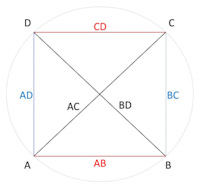
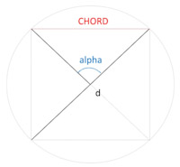

# Ptolemy's table of chords
[Demo movie](https://m.youtube.com/watch?v=xUpBBr5btvk)

`CHORD` application for Android (Schrausser, [2023](https://doi.org/10.5281/zenodo.7948117)): Famous table of chord lengths according to Ptolemy's *Almagest* ([1515](https://doi.org/10.3931/e-rara-206), fol. 7r ff.) converted into decimal values and calculated in comparison using the sine function, see Halma ([1813](https://ia600202.us.archive.org/12/items/bub_gb_a9nvvbG-OOIC/bub_gb_a9nvvbG-OOIC.pdf), p. 38 ff.),  Heiberg ([1898](https://archive.org/details/pt1claudiiptolemaei01ptoluoft/page/n561/mode/2up), p. 48 ff.) or Toomer ([1984](https://doi.org/10.2307/631776), p. 57 ff., [1998](https://www.amazon.de/Ptolemys-Almagest-Ptolemy/dp/0691002606), res.), c.f. `chords_time` tables, Schrausser ([2024](https://doi.org/10.31219/osf.io/dv4nz)), respectively.  
Chord lengths $l_0$ are *derived* according to *Ptolemy's theorem* (Fig. 1) within the relation between four sides and two diagonals of a cyclic quadrilateral where

$$AC\cdot BD = AB\cdot CD + BC\cdot AD.$$

Figure 1.

Chord lengths $l_0$ (Fig. 2) are expressed in fractional parts of sexagesimal numerals $x$ $y$ $z$. Decimal values $l_1$ are calculated by

$$l_1=x+\frac{y}{60}+\frac{z}{60^2}.$$

Figure 2.

*Sixtieth* is the average interpolation number to be added to length $l_0$ or $l_1$ each time angle increases by one minute of arc, that is $n=30$ times per half angle degree $\alpha$.  
Lengths $l_2$ to given arcus $\alpha$ and diameter $d$ are calculated using the sine function, where

$$l_2=d\cdot\sin\frac{\alpha\cdot\pi}{360}.$$

This is equivalent in terms of content to distance $s$ or radius $r$ determination via angular diameter $V$ with 

$$r=s\cdot\tan\frac{V}{2}.$$

In the absence of trigonometric sine functions, however, no *calculation* was made with distance parameters $s$, but tabularized values from previous model calculations with given $d=120$ by means of the *Pythagorean theorem*

$$a^2+b^2=c^2$$

were used and interpolated to the corresponding angle values of expansion:  

Figure 3.

Chord parameters $l_{(120)}$ can then be adapted to empirical $l_{(d)}$ proportions by transforming the model parameter with

$$l_{(d)} = l_{(120)}\cdot\frac{d}{120}.$$

Chord length values $l_{(d)}$ corresponding to *empirical* distances $s$ can be expressed by multiplying with a ratio factor $\delta$ as $l_{(e)}=l_{(d)}\cdot\delta$ to given angle $\alpha$, where according to *Pythagoras* 

$$\delta=s\cdot\Biggl(\frac{D}{2}^2-\frac{L}{2}^2\Biggr)^{-\frac{1}{2}}.$$

Differences $diff$ show the difference between (1) *sixtieth* and arithmetical interpolation as well as the difference between (2) the calculation types of chord lengths $l_1$ and $l_2$, see `chords`, `chords_tab` or `chords.xlsx` tables.  
Using this method along with methods for parallax determination, Ptolemy was able to determine e.g. Moon's *distance* and *radius* quite accurate:
>"We have explained in the Almagest [...] that the least distance of the Moon is 33 earth radii, and its greatest distance 64 earth radii [...] ", (Goldstein, [1967](https://doi.org/10.2307/1006040), p. 7).

### References

Goldstein, B. R. (1967). The Arabic Version of Ptolemy’s Planetary Hypotheses. *Transactions of the American Philosophical Society, 57*(4), 3–55. [DOI:10.2307/1006040](https://doi.org/10.2307/1006040)

Halma, N. (1813). *Composition mathématique de Claude Ptolémée.* Traduite pour la première fois du grec en français, sur les manuscrits originaux de la Bibliothèque Impériale de Paris, par M. Halma; et suivie des notes de M. Delambre, ... A Paris, chez Henri Grand, libraire, Rue Saint-André-des-Arcs, N° 51. (Mathematical composition of Claude Ptolemy. Translated for the first time from Greek into French, on the Original Manuscripts of the Imperial Library of Paris...) [https://gallica.bnf.fr/ark: /12148/bpt6k62056165?rk=21459;2](https://ia600202.us.archive.org/12/items/bub_gb_a9nvvbG-OOIC/bub_gb_a9nvvbG-OOIC.pdf)

Heiberg, J. L. (1898). *Claudii Ptolemaei Opera quae exstant omnia. Syntaxis Mathematica*. Vol. 1. 1. Lipsae: In aedibus B. G. Teubneri. [https://archive.org/details/pt1claudiiptolemaei01ptoluoft/page/n561/mode/2up](https://archive.org/details/pt1claudiiptolemaei01ptoluoft/page/n561/mode/2up)

Ptolemaeus, C. (1515). *Almagestum CL. Ptolemei Pheludiensis Alexandrini astronomorum principis: Opus ingens ac nobile omnes Caelorum motus continens.* Felicibus astris eat in lucem: Ductu Petri Liechtenstein Coloniensis Germani. Anno Virginei Partus, 1515, Die 10. Ia. Venetiis ex officina eiusdem litteraria. (Almagest of CL. Ptolemy Pheludiens, head of the Alexandrian astronomers: A great and noble work containing all the movements of the heavens...)
 [DOI:10.3931/e-rara-206](https://doi.org/10.3931/e-rara-206)

Schrausser, D. G. (2023). *Schrausser/Ptolemy-s-table-of-chords: Calculator (v3.5.7)*. Zenodo. [DOI:10.5281/zenodo.7948117](https://doi.org/10.5281/zenodo.7948117)

———. (2024). Ptolemy’s Table of Chords: Implications Considered and Discussed. *OSF Open Science Framework, 05/24*. [DOI:10.31219/osf.io/dv4nz](https://doi.org/10.31219/osf.io/dv4nz)

Toomer, G. J. (1984). *Ptolemy's Almagest*. Duckworth, London & Springer, New York. [DOI:10.2307/631776](https://doi.org/10.2307/631776)

———. (1998). *Ptolemy’s Almagest. Revised.* Princeton, NJ: Princeton University Press. [https://www.amazon.de/Ptolemys-Almagest-Ptolemy/dp/0691002606](https://www.amazon.de/Ptolemys-Almagest-Ptolemy/dp/0691002606)
